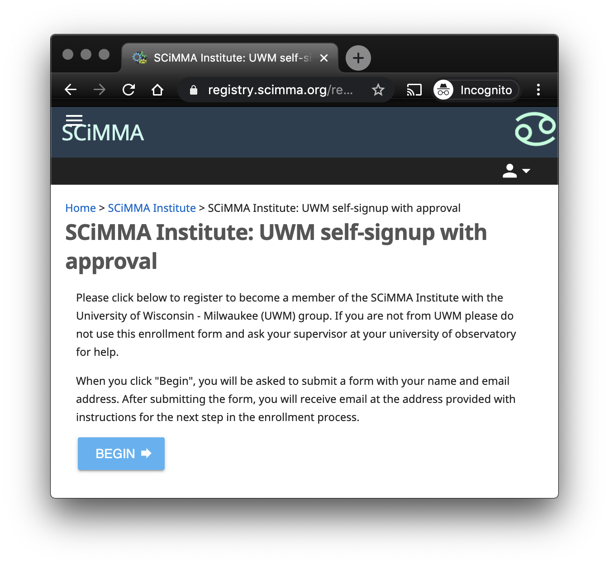

### How to join the SCiMMA Institute

#### Introduction
Currently, only members of organizations receiving funding from related awards are eligible to join the institute.
Each organization that is participating will have a manager who will receive an email as part of your enrollment
process and who will be able to approve your enrollment request. If you are unsure about whether you are eligible 
to enroll, please contact your supervisor at your organization.

Enrolling is mostly self-explanatory, but if you have any questions or concerns, there are detailed instructions below.

#### Step 1 - Begin Enrollment
To start your enrollment request, please click <a href="https://scimma.github.io/IAM/" target="_blank">here</a> and 
click on the logo of your organization (university or observatory). You will see an page like the one below, asking 
you to login.

The word Google is actually a dropdown menu. 

If you click on it, it will show you all the login servers available to login, but will also provide a text box where 
you can type in the name of the login server you want to use. The best option for most people is the organization through
which they are joining the SCiMMA Institute. Type the name of your organization into the text box and it will show you 
the login servers that most closely match your text. If your organization is not listed, then you cannot use its login 
server to login here. The next best option for most researchers is their <a href="https://orcid.org" target="_blank">ORCID</a>. You may already have an ORCID. If not, you can create one. For 
those who have no other option, we also support the deafault "Google" option, for which you can use a gmail login. 
Below the login server selection menu is the "Remember this selection" button. 

If you click it, you will never be asked which login service you want to use again, not just for the SCiMMA institute, 
but possibly for other research applications hosted in the same way. If you never intend to use any login service than 
the one you have selected for research, you can click it, otherwise please leave it unclicked. Finally, there is the 
"Log On" button at the bottom of the page. 

You can click that to login to your login server. Enter the username and password you would normally use for the page 
you arrive at, and do whatever else (e.g. Duo authentication) you need to do to login. Once you are done, you will be 
logged in and will see a page like this (but appropriate for the organization whose logo you first clicked to start 
the enrollment process).

Clicking begin will launch the enrollment and you may see some messages about various processes being automatically 
completed. After a few seconds, you should arrive at a page like the following

Your name and email address will be filled in with information that we got when you logged in. You may change any part of
it. Note that the email address must be valid or you will not be able to complete the enrollment. Also, your name will 
appear in various contexts, so if you have a name preference (e.g. Jim vs James), you can adjust it here.
